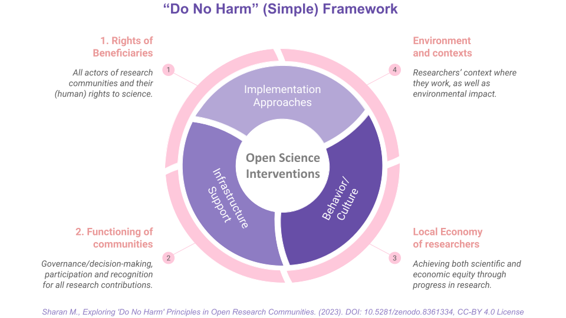

# Do No Harm Simple for Open Science 

*Extending the use of do no harm principle, from medicine and humanitarian work, to open science approaches, when applied in research, data science and AI across different domains and sectors.*

## About

*"Do no harm (DNH) means taking a step back from an intervention to look at the broader context and mitigate potential negative effects on the social fabric, the economy and the environment. **By placing an emphasis on taking a step back, the DNH principle encourages actors to think before they act.***" — Jean Martial Bonis Charancle and Elena Lucchi (2018)
> Source: Incorporating the Principle of “Do No Harm”: How to Take Action Without Causing Harm: [Reflections on a Review of Humanity & Inclusion’s Practices](https://www.alnap.org/help-library/incorporating-the-principle-of-%E2%80%9Cdo-no-harm%E2%80%9D-how-to-take-action-without-causing-harm)

The “do no harm” principle has been widely applied in the context of medical research and health care, and later extended in humanitarian aid work to consider both intended and unintended consequences of an intervention (CDA 2018).  Institutional policies, ethical frameworks and research participation guidelines also mention or embed the principle implicitly. 

In the technical context, the [Organization for Ethical Source](https://ethicalsource.dev/licenses/) is in the early stages of developing ethical source licenses such as ‘Hippocratic License’ and ‘Do No Harm License’, which promote responsible use of software. 
However, it has not been discussed or explored in the larger context of open science.

This repository collects resources, data and research details including outcomes from the self-led project exploring Do No Harm in the context of open science. Particularly, I am developing a framework and will explore its practicality in assessing and improving open science practices and intervention in the context of research projects, data science and AI technologies. 

## Preliminary Research

I have recently conducted a preliminary study for applying Do No Harm in open science, a written report from which will be published soon.
A major takeaway from the study is a simple framework that can be used by anyone in their respective context.

Figure 1: Do No Harm Simple Framework for Open Science. Source: Sharan, M. (2023, September 19). Exploring 'Do No Harm' Principles in Open Research Communities. Zenodo. https://doi.org/10.5281/zenodo.8361334.

The potential negative effects of open science practices can be assessed under four groups (outer layer in Figure 1):
1. Stakeholders and beneficiaries, which include all actors in research communities and their rights to science.
1. Community functioning and relationships between actors, which are enabled by governance and decision-making processes and participatory approaches.
1. Local economy of researchers, with a goal to achieve both scientific and economic progress of people involved and affected by the research.
1. Environment that encompasses the context in which researchers conduct their work as well as the broader environmental impact.

The negative effects of open science practices can be addressed by three overarching methods (inner layer in Figure 1):
* implementing approaches, such as practices, recommendations, and collective actions, that promote participation; 
* providing infrastructure support, both social and technological infrastructure as well as appropriately incentivised people who maintain them; and
* promoting behaviours that result in positive cultural change and impacts.

### Collaborate with me

I am looking for collaboration with practitioners from different domains and sectors and would like to improve the framework for different stakeholders working in research across academia, government, the public sector, non-profit, funding, policymaking and ethical deployment of a commercial/non-commercial tool.

**Potential Outputs**: 
- Feedback on the framework and interest to collaborate on this study
- Funding to conduct more rigorous study on Do No Harm for open science in the context of Global South-North collaboration
- Examples of projects where the Do No Harm framework has been applied
- Story, essays and case studies from different practitioners exploring Do No Harm in their contexts
- Versions of Do No Harm frameworks for different contexts
- Training materials and workshops assisting researchers in applying the Do No Harm framework to their work
- Policy briefing advocating for the integration of Do No Harm in open science and ethical frameworks

**Maintainers**

This repository has been set up and maintained by Malvika Sharan.

*Please create [an issue](../../issues) to share references or ideas related to the development of this project.*

📫 Contact
---

For any organisation-related queries or concerns, you can directly reach out to Malvika Sharan by emailing [malvikasharan@gmail.com](mailto:malvikasharan@gmail.com).

♻️ License
---

This work is licensed under the MIT license (code) and Creative Commons Attribution 4.0 International license (for documentation).

You are free to share and adapt the material for any purpose, even commercially,
as long as you provide attribution (give appropriate credit, provide a link to the license,
and indicate if changes were made) in any reasonable manner, but not in any way that suggests the
licensor endorses you or your use and with no additional restrictions.

